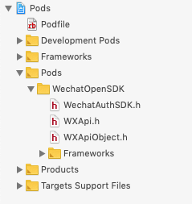

## Using Swift?
`fluwx` supports `swift` since 2.0.0. However,before using swift, there's still a little work to do.
If anyone has better solutions, tell me please or open a PR.

## Make Headers Public
There is an exception called `include non-modular headers` if compiling `fluwx` directly because `WeChatOpenSDK` uses static library.
We have to make the headers in `WeChatOpenSDK` public in order to support swift:




## Response
override the following functions in `AppDelegate.swift`:
```swift

  import fluwx

  override  func application(_ application: UIApplication, open url: URL, sourceApplication: String?, annotation: Any) -> Bool {
        return WXApi.handleOpen(url, delegate: FluwxResponseHandler.defaultManager())
    }

    // NOTE: 9.0以后使用新API接口
  override  func application(_ app: UIApplication, open url: URL, options: [UIApplication.OpenURLOptionsKey : Any] = [:]) -> Bool {
        return WXApi.handleOpen(url, delegate: FluwxResponseHandler.defaultManager())
    }

```