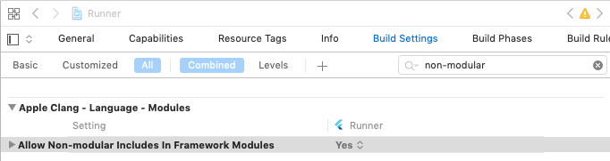

## 使用Swift?
`fluwx` 从*2.0.0*开始支持 `swift`。 但是在使用swift之前, 我们还有一些工作要做。
如果有人知道更好的方式，请告诉我或者提一个PR。

## Allow Non-modular Includes

当我们使用swift编译`fluwx`的时候会报一个错误： `include non-modular headers`。
为了支持swift,我们不得不允许*non-modular includes*，打开你的target设置:




## 回调监听
在你的`AppDelegate.swift`文件中重写以下方法：
```swift
  //swift4.1
  import fluwx


  override  func application(_ application: UIApplication, open url: URL, sourceApplication: String?, annotation: Any) -> Bool {
        return WXApi.handleOpen(url, delegate: FluwxResponseHandler.defaultManager())
    }

    // NOTE: 9.0以后使用新API接口
  override  func application(_ app: UIApplication, open url: URL, options: [UIApplication.OpenURLOptionsKey : Any] = [:]) -> Bool {
        return WXApi.handleOpen(url, delegate: FluwxResponseHandler.defaultManager())
    }

```

```swift
  //swift4.2
  import fluwx

  //  Converted to Swift 4 by Swiftify v4.1.6841 - https://objectivec2swift.com/
  override func application(_ application: UIApplication, open url: URL, sourceApplication: String?, annotation: Any) -> Bool {
      return WXApi.handleOpen(url, delegate: FluwxResponseHandler.defaultManager())
  }

  // NOTE: 9.0以后使用新API接口
  override func application(_ app: UIApplication, open url: URL, options: [UIApplicationOpenURLOptionsKey : Any] = [:]) -> Bool {
      return WXApi.handleOpen(url, delegate: FluwxResponseHandler.defaultManager())
  }


```
